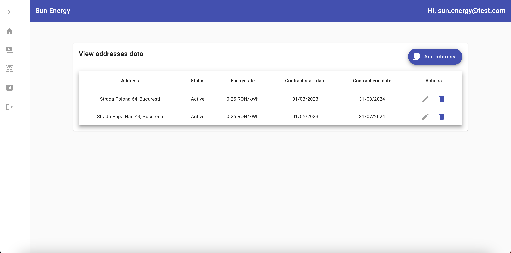
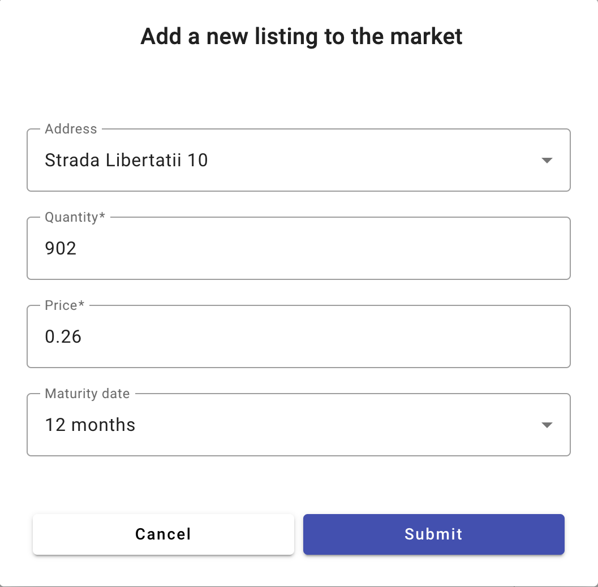

## Sun Energy

# Application description and info

- Application for master's thesis
- Front-End technologies and libraries: Angular, Angular Material, Apache Echarts and Angular Toastr
- Back-End technologies and libraries: Node.js (TypeScript), Stripe, Firebase
- The application was built from the perspective of a electricity supplier company, whose target audience are consumers and prosumers. Aside from a normal vendor application, it also has a proof of concept for selling the surplus energy in a market for other people to buy.
- The aim of this application is to provide a solution for the energy market, especially for people who have solar panels and produce more than they consume. It has pages dedicated to visualising the data coming from your system's solar panels and consumption from your property. It has a bills page, where the user can see every month's bill and pay it there, if it is the case. Another core part is the market page, where each person can list their leftover energy at a higher rate than they have in their contract. The reason this would work and provide value for both the seller and the buyer is that energy costs are variable on a yearly basis and it provides the buyer the oportunity to get their energy at a lower price than offered, while the seller can obtain more than from their curent contract. Lastly, there is a page that aggregates revenue data and displays it.

# Main functionalities and workflows

- Sign up with e-mail/password
- Login/Logout
- Reset password for account by sending e-mail (Implemented using Firebase)
- Addresses (View, add, request deletion, extend contract) -> Details panel for address (Consumption and production data for the current year) -> View all solar panels -> View data for a single panel for the current year
- Bills (Select address) -> View bills (Bills can be paid here, payment implemented with Stripe)
- Market (View bought and listed energy listings):

1. List a new entry (Deletable until another person buys it)
2. Buy a listing from the available market (Non-refundable)

- Stats -> View revenue stats for the current year (Revenue has 2 pillars: bills generated and commision from sold energy listings)

# Screenshots

- Adresseses view
  

- Address details view
  

- Bills view
  

- Bill payment
  

- Market page, bought listings table
  

- Market page, sold listings table
  

- Market page, list a new entry
  

- Company revenue page
  
